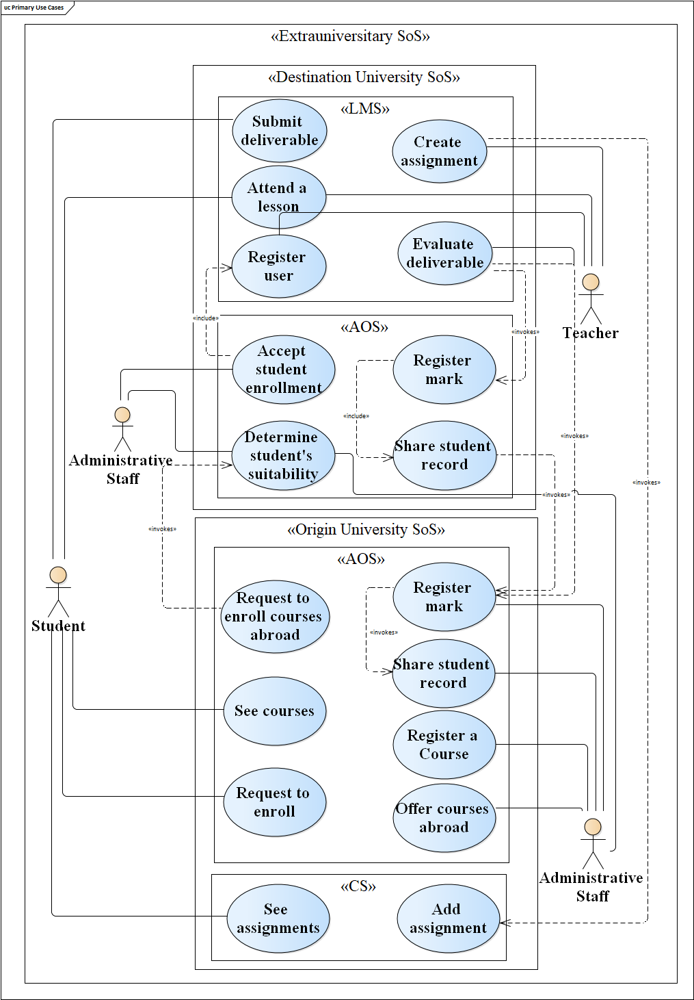

EDUFYSoS is a  factory of educational System of Systems (SoSs)  that can be used as case studies for evaluating SoS research, in particular SoS testing.
The term "factory" is inspired by the Gang of Four (GoF) Factory design pattern. As in this pattern, with EDUFYSoS, we can create a family of SoS related to an educational domain as well as extend it and open it to host other case studies. 

The figure below presents an overview of EDUFYSoS. It provides educational SoSs scenarios, the set of constituent systems that we can use to implement them, the process we followed to build these scenarios, and the guidelines for supporting instantiate these scenarios. For more info, see the [paper reference](#paper-reference).

Table of contents
=================

* [Case Studies](#case-Studies)
  * [Basic Educational SoS](#basic-educational-sos)
    * [Instantiation](#basic-educational-sos-instantiation)
  * [Student Mobility SoS](#student-mobility-sos)
    * [Instantiation](#student-mobility-sos-instantiation)
  * [International Master SoS](#international-master-sos)
    * [Instantiation](#international-master-sos-instantiation)
    
* [Paper Reference](#paper-reference)
* [Contributing](#contributing)
* [Team](#team)

# Case Studies

EDUFYSoS provides three different case studies in the educational domain that emerge from the combination of a same set of constituent systems, accomplishing different missions. The constituent IT systems are: 

**Admnistrative Office System:** should have the ability to manage information about courses and students at university

**Learning Management System:** should deliver online educational courses, trace the students activities and report on their results

**Calendar System:** represents a  time-management system providing the user with the ability to manage appointments, events and deadlines

## Basic Educational SoS

The goal of this SoS is to allow students to attend online courses  and  manage  the  classes  and  their  assignments  in  an integrated way. The Mission Model, Use Case and Componentes diagram are presented below:

**Mission Model**

**Use Case Diagram**

**Components Diagram**

### **Basic Educational SoS Instantiation**
To instantiate the Basic Educational SoS, we choose as constituent systems:

**Admnistrative Office System:** [RosarioSIS](https://www.rosariosis.org/)

**Learning Management System:** [Moodle](https://moodle.org/)

**Calendar System:** [GoogleCalendar](https://calendar.google.com/)

All the steps performed to build this concrete SoS are described in the [issues](https://github.com/edufysos/edufysos/issues) session with label [**basicSoS**](https://github.com/edufysos/edufysos/issues?q=is%3Aissue+label%3AbasicSoS). 
A tested version of [Moodle](https://github.com/edufysos/moodle) and [RosarioSiS](https://github.com/edufysos/rosariosis) is available at EDUFYSoS organization with all necessary plugins for integration. Also, [this guide](https://github.com/edufysos/edufysos/blob/master/guidelines/BasicEducationalSoS.pdf) shows step by step on how to configure and integrate these constituent systems as well as presents the main functionalities of this scenario.  

## Student Mobility SoS

The “Student Mobility” SoS supports a mobility programme that allows students belonging to a university to make a study period  at  a  partner  university (e.g., both  in  the same country or abroad like in the EU programme Erasmus). This exchange study period is part of the student’s study programme  to complete a degree. The Mission Model, Use Case and Componentes diagram are presented below:

**Mission Model**

**Use Case Diagram**

**Components Diagram**

### **Student Mobility SoS Instantiation**
To instantiate the Student Mobility SoS, we choose the same constituent system of the Basic Educational SoS:

**Admnistrative Office System:** [RosarioSIS](https://www.rosariosis.org/)

**Learning Management System:** [Moodle](https://moodle.org/)

**Calendar System:** [GoogleCalendar](https://calendar.google.com/)

All the steps performed to build this concrete SoS are described in the [issues](https://github.com/edufysos/edufysos/issues) session with label [**mobilitySoS**](https://github.com/edufysos/edufysos/issues?q=is%3Aissue+label%3AmobilitySoS). 
A tested version of [Moodle](https://github.com/edufysos/moodle) and [RosarioSiS](https://github.com/edufysos/rosariosis) is available at EDUFYSoS organization with all necessary plugins for integration. Also, [this guide](https://github.com/edufysos/edufysos/blob/master/guidelines/MobilitySoS.pdf) shows step by step on how to configure and integrate these constituent systems as well as presents the main functionalities of this scenario.  

## International Master SoS

The  “International  Master”  SoS  refers  to  the  case that  a shared degree is offered by a set of universities with the aim of providing the student with a multicultural learning experience. The master is  offered  under  the  shared  responsibility  of the joining  universities.  In  this  sense, the  administrative  offices of  each  university  manage the  courses  they  offer  within  the international master program, also they cooperate in order to share the evaluations marked by the students during examinations. The Mission Model, Use Case and Componentes diagram are presented below:

**Mission Model**

**Use Case Diagram**

**Components Diagram**

### **International Master SoS Instantiation**
We are still working to instantiate this scenario. However, you can follow the [issues](https://github.com/edufysos/edufysos/issues) session with label [**internationalMasterSoS**](https://github.com/edufysos/edufysos/issues?q=is%3Aissue+label%3AinternationalMasterSoS). 

# Paper Reference

A. Bertolino, G. De Angelis, F. Lonetti, V. O. Neves, M. A. Olivero. 
**EDUFYSoS: A Factory of Educational System of Systems Case Studies**. In Accepted for publication at System of Systems Engineering Conference ([SoSE 2020](http://conf.uni-obuda.hu/sose2020/)), Budapest, Hungary, June 2020

# Contributing

You can contribute to EDUFYSoS by suggesting new scenarios, constituent systems, and/or helping with systems integration. To do so, [submit an issue](https://github.com/edufysos/edufysos/issues) or [send a pull request](https://github.com/edufysos/edufysos/pulls).

# Team

* Vânia de Oliveira Neves (IC-UFF)
* Miguel Angel Olivero (CNR-ISTI)
* Antonia Bertolino (CNR-ISTI)
* Francesca Lonetti (CNR-IASI)
* Guglielmo De Angelis (CNR-ISTI)
* Jhonatan Azevedo Gonçalves (IC-UFF)

